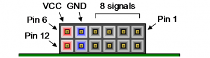

CMOD-A7 I/O board pin assignment
================================

Revision 2.1.2, 2020-11-08 (SC).

Introduction
------------

The [Digilent CMOD-A7](https://store.digilentinc.com/cmod-a7-breadboardable-artix-7-fpga-module/) is an inexpensive
FPGA development board built around a Xilinx Artix A7 FPGA. It is implemented as a breadboard-friendly 48-pins DIP module.


We will design and manufacture an Open Hardware I/O board for the CMOD-A7 that will allow its application in R&D environments
where robust digital I/O is required.

In addition, the I/O board will feature a reference clock input, 2 analog inputs for the 1 MS/s on-board ADCs of the FPGA,
a gigabit Ethernet connector, a standard PMOD connector, and a pin header for the pins that remain.

The image below shows the pin numbering of the CMOD-A7 module:


Pins 15 and 16 are the analog input channels.
The voltage input range on the pins is 0-3.3V, which is scaled to the 0-1V range expected by the FPGA's ADC input pins.

Pin 24 is VU.
It can be used as power supply to the CMOD-A7 (in case no USB is connected) or as a USB voltage monitor in case USB is connected.
Our I/O board is designed to allow safe powering of the CMOD-A7 module from either the USB or the external power supply.

Pin 25 is GND. It is a bit unfortunate that we only have a single ground pin, but it will have to do.

The other 44 pins are PIO (programmable I/O) pins that connect directly to FPGA pins.
All these pins use LVCMOS33 (low voltage CMOS, 3.3V) signal levels.

The 44 PIO pins
---------------

Not all PIO pins are created equal, because the FPGA pins to which they are connected have different capabilities:

* Some FPGA pins are designed for high-performance clock input signals.
* Most FPGA pins can be configured for use as differential pairs.

Below we list all 44 PIO pins, both using their PIO number and their Xilinx I/O pin identifier, for example 'PIO3 (IO_L12P_T1_MRCC_16)'.

We specify whether the pins are 'clock-in capable' or 'regular' (i.e., not clock-in capable).

Clock-in capable pins are those pins for which the Xilinx I/O pin identifier contains either 'MRCC' or 'SRCC'. The MRCC pins can be
routed globally anywhere inside the FPGA, whereas the SRCC can be routed to a subset of the FPGA.

* Note 1: Regular pins can also be used to lead clock signals into the FPGA, but this is sub-optimal,
          explicitly discouraged by the Xilinx documentation, and requires constraint file directives to override warnings in Vivado.
* Note 2: Clock signals routed from the inside of the FPGA to the outside can be routed over 'regular' pins without issue.

Note that pair-capable pins don't *have* to be used as pairs, they can also be used as two single-ended pins.

In case of using a clock-in capable pair as 2 regular pins, the positive pin of the pair can be used as a single-ended clock input.

### Clock-in capable differential PIO pairs (6 pairs, 12 pins)

id   | positive pin (Xilinx name) | negative pin (Xilinx name) | remark
---- | -------------------------- | -------------------------- | ----------------
cp1  | PIO5  (IO_L11P_T1_SRCC_16) | PIO8  (IO_L11N_T1_SRCC_16) | clock-in capable
cp2  | PIO18 (IO_L12P_T1_MRCC_35) | PIO19 (IO_L12N_T1_MRCC_35) | clock-in capable
cp3  | PIO36 (IO_L12P_T1_MRCC_34) | PIO40 (IO_L12N_T1_MRCC_34) | clock-in capable
cp4  | PIO38 (IO_L11P_T1_SRCC_34) | PIO37 (IO_L11N_T1_SRCC_34) | clock-in capable
cp5  | PIO46 (IO_L13P_T2_MRCC_34) | PIO43 (IO_L13N_T2_MRCC_34) | clock-in capable
cp6  | PIO47 (IO_L14P_T2_SRCC_34) | PIO48 (IO_L14N_T2_SRCC_34) | clock-in capable

### Clock-in capable single-ended PIO pins (1 pin)

id   | single-ended pin (Xilinx name) | remark
---- | ------------------------------ | ----------------
cs1  | PIO3 (IO_L12P_T1_MRCC_16)      | clock-in capable

The corresponding negative pin exists on the FPGA but it is not exposed as a DIP pin; it is used to drive one of the CMOD-A7 LEDs.

### Regular (not clock-in capable) differential PIO pairs (14 pairs, 28 pins)

id   | positive pin (Xilinx name)    | negative pin (Xilinx name)    | remark
---- | ----------------------------- | ----------------------------- | --------------------
rp1  | PIO2  (IO_L8P_T1_AD14P_35)    | PIO1  (IO_L8N_T1_AD14N_35)    | not clock-in capable
rp2  | PIO6  (IO_L3P_T0_DQS_AD5P_35) | PIO11 (IO_L3N_T0_DQS_AD5N_35) | not clock-in capable
rp3  | PIO9  (IO_L6P_T0_16)          | PIO7  (IO_L6N_T0_VREF_16)     | not clock-in capable
rp4  | PIO10 (IO_L7P_T1_AD6P_35)     | PIO4  (IO_L7N_T1_AD6N_35)     | not clock-in capable
rp5  | PIO12 (IO_L5P_T0_AD13P_35)    | PIO14 (IO_L5N_T0_AD13N_35)    | not clock-in capable
rp6  | PIO20 (IO_L9P_T1_DQS_AD7P_35) | PIO17 (IO_L9N_T1_DQS_AD7N_35) | not clock-in capable
rp7  | PIO22 (IO_L10P_T1_AD15P_35)   | PIO21 (IO_L10N_T1_AD15N_35)   | not clock-in capable
rp8  | PIO26 (IO_L2P_T0_34)          | PIO27 (IO_L2N_T0_34)          | not clock-in capable
rp9  | PIO28 (IO_L1P_T0_34)          | PIO30 (IO_L1N_T0_34)          | not clock-in capable
rp10 | PIO29 (IO_L3P_T0_DQS_34)      | PIO31 (IO_L3N_T0_DQS_34)      | not clock-in capable
rp11 | PIO33 (IO_L5P_T0_34)          | PIO32 (IO_L5N_T0_34)          | not clock-in capable
rp12 | PIO35 (IO_L6P_T0_34)          | PIO34 (IO_L6N_T0_VREF_34)     | not clock-in capable
rp13 | PIO41 (IO_L16P_T2_34)         | PIO39 (IO_L16N_T2_34)         | not clock-in capable
rp14 | PIO44 (IO_L9P_T1_DQS_34)      | PIO42 (IO_L9N_T1_DQS_34)      | not clock-in capable

### Regular (not clock-in capable) single-ended PIO pins (3 pins)

id   | single-ended pin (Xilinx name) | remark
---- | ------------------------------ | --------------------
rs1  | PIO13  (IO_L6N_T0_VREF_35)     | not clock-in capable
rs2  | PIO23  (IO_L19N_T3_VREF_35)    | not clock-in capable
rs3  | PIO45  (IO_L19P_T3_34)         | not clock-in capable

External interfaces
-------------------

The following interfaces will be implemented on the I/O board:

interface            | remarks
-------------------- | ------------------------------------------------------------------------------
ANALOG-IN (BNC)      | 2 special pins 15 and 16 of the CMOD-A7 module; analog inputs, not PIOs.
DIGITAL-IN (BNC)     | 8 pins, 5 of which will be clock-input-capable pins.
DIGITAL-OUT (BNC)    | 8 pins.
REFCLOCK-IN (BNC)    | 1 clock-in capable pin. Incoming signal is AC-coupled and then compared to 0V.
Ethernet PHY (RGMII) | 16 pins, 1 of which must be clock-in capable (see below for details).
PMOD                 | 8 pins, no special requirements.
AUX HEADER           | 3 pins with neighboring ground pins as a 3x2 standard-pitch pin header.

The grand total for PIO (digital I/O) pins: 44 pins used for the interfaces, 7 of which must be clock-in capable.

The Ethernet PHY interface has the following pin requirements:

pin(s)   | remarks
-------- | ---------------------------------------------------------------------------------------------------
TXC      | TX-side: clock (125 MHz). Generated by the FPGA.
TXCTL    | TX-side: data valid.
TXD 0..3 | TX-side: outgoing data (4 bits, DDR)
RXC      | RX-side: clock (125 MHz). Generated by the PHY. Must connect to a clock-in capable pin of the FPGA.
RXCTL    | RX-side: data valid.
RXD 0..3 | RX-side: incoming data (4 bits, DDR)
MDC      | Management interface clock. Generated by the FPGA.
MDIO     | Management interface I/O. Bidirectional.
RESET_N  | Reset PHY (FPGA to PHY). Active-low.
INT_N    | Interrupt request (PHY to FPGA). Active-low.

Mapping of available PIOs to interfaces
---------------------------------------

The primary consideration with regard to pin assignment will be the assignment of clock-in capable pins.
Seven clock-in capable pins are available on the CMOD-A7, and all seven of them will be explicitly used as such.

Two other considerations are far less important, but can guide the mapping choice in case there is
no clear reason to prefer one choice over another:

* While our design will not use differential signaling, it is somewhat nice if P/N pairs are used for ports that have similar
  functions and sit next to each other. For example, for our 8 BNC outputs, we use 4 differential pin pairs.
* Inside the FPGA, the signals are organized in I/O banks. It is nice to aim to assign related functions to the same I/O bank,
  e.g. to have the digital PIOs connected to FPGA pins belonging to bank 34.

However, other considerations such as PCB layout may lead to deviations from these 'nice-to-have' guidelines!

Pin mapping
-----------

### Analog input (2 pins)

The analog input pins are fixed by the CMOD-A7 design to pins 15 and 16 of the DIP module.

function         | pin | remarks
---------------- | --- | -------------------------------------------------------
BNC Analog-In #0 |  15 | via analog buffer IC; range mapped from 0-5V to 0-3.3V.
BNC Analog-In #1 |  16 | via analog buffer IC; range mapped from 0-5V to 0-3.3V.

### Digital output pins via BNC (8 pins)

The digital outputs will drive 5V into a 50 Ohm BNC cable, with 50 Ohm source termination; it should
therefore be capable of sourcing 50 mA.

The 8 digital outputs don't need to be clock-in capable.

We select them from bank 34.

Consecutive odd/even numbered digital outputs are chosen to be positive/negative FPGA pins of a
differential I/O pair of the FPGA.

function    | pin                      | remarks
----------- | ------------------------ | -------
IO_DOUT_Ch0 | PIO26 (IO_L2P_T0_34)     |
IO_DOUT_Ch1 | PIO27 (IO_L2N_T0_34)     |
IO_DOUT_Ch2 | PIO28 (IO_L1P_T0_34)     |
IO_DOUT_Ch3 | PIO30 (IO_L1N_T0_34)     |
IO_DOUT_Ch4 | PIO29 (IO_L3P_T0_DQS_34) |
IO_DOUT_Ch5 | PIO31 (IO_L3N_T0_DQS_34) |
IO_DOUT_Ch6 | PIO33 (IO_L5P_T0_34)     |
IO_DOUT_Ch7 | PIO32 (IO_L5N_T0_34)     |

### Digital input pins via BNC (8 pins, 5 of which will be clock-in capable)

The digital inputs will be BNCs with a selectable termination to ground of either
50 Ohm or 10 kOhm.

We will have 8 digital inputs, with 5 of them clock-in capable.

We get four clock-capable inputs from bank 34, and one from bank 16.

Consecutive odd/even numbered digital outputs are chosen to be positive/negative FPGA pins of a
differential I/O pair of the FPGA, except for channel #7. Making the clock-in capable PIO5
pin available is considered more important.

function   | pin                        | remarks
---------- | -------------------------- | ----------------
IO_DIN_Ch0 | PIO47 (IO_L14P_T2_SRCC_34) | clock-in capable
IO_DIN_Ch1 | PIO48 (IO_L14N_T2_SRCC_34) |
IO_DIN_Ch2 | PIO46 (IO_L13P_T2_MRCC_34) | clock-in capable
IO_DIN_Ch3 | PIO43 (IO_L13N_T2_MRCC_34) |
IO_DIN_Ch4 | PIO38 (IO_L11P_T1_SRCC_34) | clock-in capable
IO_DIN_Ch5 | PIO37 (IO_L11N_T1_SRCC_34) |
IO_DIN_Ch6 | PIO36 (IO_L12P_T1_MRCC_34) | clock-in capable
IO_DIN_Ch7 | PIO5  (IO_L11P_T1_SRCC_16) | clock-in capable

#### External clock reference (1 pin, clock-input-capable)

The reference clock input will connect to PIO3, the one purely single-ended clock-in pin available
on the CMOD-A7 DIP pinout.

function          | pin                       | remarks
----------------- | ------------------------- | ------------------------------------------------
IO_REF_CLK        | PIO3 (IO_L12P_T1_MRCC_16) | clock-in capable; AC coupled, via comparator IC.

### Ethernet PHY, RGMII (16 pins, one of which must be clock-in capable)

The board will be equipped with a Microchip [KSZ9131RNX](http://ww1.microchip.com/downloads/en/DeviceDoc/00002841B.pdf) Gigabit ethernet transceiver.


We need 16 PIOs, with one of them (RXC) clock-in capable.

The pin mapping proposed here gives a somewhat natural pin order for the interface pins, which will hopefully make make routing a bit easier.

function       | pin                           | remarks
-------------- | ----------------------------- | ------------------------
IO_PHY_TXC     | PIO6  (IO_L3P_T0_DQS_AD5P_35) |
IO_PHY_TXCTL   | PIO7  (IO_L6N_T0_VREF_16)     |
IO_PHY_TXD0    | PIO8  (IO_L11N_T1_SRCC_16)    |
IO_PHY_TXD1    | PIO9  (IO_L6P_T0_16)          |
IO_PHY_TXD2    | PIO10 (IO_L7P_T1_AD6P_35)     |
IO_PHY_TXD3    | PIO11 (IO_L3N_T0_DQS_AD5N_35) |
IO_PHY_RXC     | PIO18 (IO_L12P_T1_MRCC_35)    | clock-in capable
IO_PHY_RXCTL   | PIO19 (IO_L12N_T1_MRCC_35)    |
IO_PHY_RXD0    | PIO20 (IO_L9P_T1_DQS_AD7P_35) |
IO_PHY_RXD1    | PIO21 (IO_L10N_T1_AD15N_35)   |
IO_PHY_RXD2    | PIO22 (IO_L10P_T1_AD15P_35)   |
IO_PHY_RXD3    | PIO23 (IO_L19N_T3_VREF_35)    |
IO_PHY_MDIO    | PIO14 (IO_L5N_T0_AD13N_35)    | bidirectional
IO_PHY_MDC     | PIO17 (IO_L9N_T1_DQS_AD7N_35) | FPGA to PHY
IO_PHY_RESET_N | PIO12 (IO_L5P_T0_AD13P_35)    | active-low (FPGA to PHY)
IO_PHY_INT_N   | PIO13 (IO_L6N_T0_VREF_35)     | active-low (PHY to FPGA)

The default behavior of the PHY can be configured by using pullup/pulldown resistors to the strap inputs.

The strap-on pins should be configured as follows:

pin | symbol    | pullup/pulldown | description
--- | --------- | --------------- | --------------------------------------
 35 | PHYAD2    | pulldown (0)    | PHY address = 0
 15 | PHYAD1    | pulldown (0)    |
 17 | PHYAD0    | pulldown (0)    |
 38 | ALLPHYAD  | pullup (1)      | Respond only to own address (0)
 27 | MODE3     | pullup (1)      | MODE 1110
 28 | MODE2     | pulldown (1)    | RGMII, advertise 10/100/1000
 31 | MODE1     | pullup (1)      |
 32 | MODE0     | pulldown (0)    |
 33 | CLK125_EN | pulldown (0)    | Disable 125 MHz clock output on pin 41
 41 | LED_MODE  | pullup (1)      | Individual LED mode

### Digilent PMOD connector (8 pins, no special requirements)

The PMOD connector is shown below. Note the pin numbering of the signal pins.



The PMOD standard is documented by Digilent in the [PMOD Interface Specification, version 1.2.0](https://reference.digilentinc.com/_media/reference/pmod/pmod-interface-specification-1_2_0.pdf).

We need 8 PIOs, with no requirements on clock input capability.

These are selected from the leftover differential pin pairs in banks 34 and 35.

Consecutive IOs are chosen to be positive/negative FPGA pins of a differential I/O pair of the FPGA.

We give the PMOD connectors a standard 200 Ohm series resistor, as suggested in Section 2 of the Digilent PMOD specification.
This allows them to be used directly to drive LEDs, or to be used as inputs for contact switches.

function          | pin                        | remarks
----------------- | -------------------------- | ----------
IO_PMOD_p1        | PIO2  (IO_L8P_T1_AD14P_35) | top row
IO_PMOD_p2        | PIO1  (IO_L8N_T1_AD14N_35) | top row
IO_PMOD_p3        | PIO44 (IO_L9P_T1_DQS_34)   | top row
IO_PMOD_p4        | PIO42 (IO_L9N_T1_DQS_34)   | top row
IO_PMOD_p7        | PIO41 (IO_L16P_T2_34)      | bottom row
IO_PMOD_p8        | PIO39 (IO_L16N_T2_34)      | bottom row
IO_PMOD_p9        | PIO35 (IO_L6P_T0_34)       | bottom row
IO_PMOD_p10       | PIO34 (IO_L6N_T0_VREF_34)  | bottom row

#### 3x2 pin header

The remaining three pins are exposed via a 3x2 pin header with standard 2.54mm spacing, each via a 200 Ohm series resistor, so we can drive LEDs safely if need be.
**TODO: Is 200 Ohm the best choice? Driving at 3.3V, we can probably make it a quite bit lower and still safely drive LEDS with a current of 20 mA, which seems to
be the agreed-upon target current for LEDs.**

These can be used for various purposes, e.g. deploying a LED or sensing a push button.

function          | pin                        | remarks
----------------- | -------------------------- | --------
IO_AUX_p1         | PIO4  (IO_L7N_T1_AD6N_35)  |
IO_AUX_p2         | PIO45 (IO_L19P_T3_34)      |
IO_AUX_p3         | PIO40 (IO_L12N_T1_MRCC_34) |

```
3x2 pin header, 2.54 mm spacing:

+------+------+------+
| pin1 | pin2 | pin3 |
+------+------+------+
| GND  | GND  | GND  |
+------+------+------+
```

Physical layout
---------------

```
                                  +------------------------+
           PMOD:pin2      rp1n <->|  1 (35)        (34) 48 |<-- cp6n   BNC:DIGIN-Ch1
           PMOD:pin1      rp1p <->|  2 (35)        (34) 47 |<-- cp6p   BNC:DIGIN-Ch0 (clock-in)
(clock-in) BNC:REFCLK-IN   c7p -->|  3 (16)        (34) 46 |<-- cp5p   BNC:DIGIN-Ch2 (clock-in)
           AUX:pin1       rp4n <->|  4 (35)        (34) 45 |<-> rs3    AUX:pin2
(clock-in) BNC:DIGIN-Ch7  cp1p -->|  5 (16)        (34) 44 |<-> rp14p  PMOD:pin3
           PHY:TXC        rp2p <--|  6 (35)        (34) 43 |<-- cp5n   BNC:DIGIN-Ch3
           PHY:TXCTL      rp3n <--|  7 (16)        (34) 42 |<-> rp14n  PMOD:pin4
           PHY:TXD0       cp1n <--|  8 (16)        (34) 41 |<-> rp13p  PMOD:pin7
           PHY:TXD1       rp3p <--|  9 (16)        (34) 40 |<-> cp3n   AUX:pin3
           PHY:TXD2       rp4p <--| 10 (35)        (34) 39 |<-> rp13n  PMOD:pin8
           PHY:TXD3       rp2n <--| 11 (35)        (34) 38 |<-- cp4p   BNC:DIGIN-Ch4 (clock-in)
           PHY:MDIO       rp5p <->| 12 (35)        (34) 37 |<-- cp4n   BNC:DIGIN Ch5
           PHY:MDC         rs1 <--| 13 (35)        (34) 36 |<-- cp3p   BNC:DIGIN-Ch6 (clock-in)
           PHY:RESET_N    rp5n <--| 14 (35)        (34) 35 |<-> rp12p  PMOD:pin9
           BNC:ADC-Ch0   (adc) -->| 15 analog-in   (34) 34 |<-> rp12n  PMOD:pin10
           BNC:ADC-Ch1   (adc) -->| 16 analog-in   (34) 33 |--> rp11p  BNC:DIGOUT-Ch6
           PHY:INT_N      rp6n -->| 17 (35)        (34) 32 |--> rp11n  BNC:DIGOUT-Ch7
(clock-in) PHY:RXC        cp2p -->| 18 (35)        (34) 31 |--> rp10n  BNC:DIGOUT-Ch5
           PHY:RXCTL      cp2n -->| 19 (35)        (34) 30 |--> rp9n   BNC:DIGOUT-Ch3
           PHY:RXD0       rp6p -->| 20 (35)        (34) 29 |--> rp10p  BNC:DIGOUT-Ch4
           PHY:RXD1       rp7n -->| 21 (35)        (34) 28 |--> rp9p   BNC:DIGOUT-Ch2
           PHY:RXD2       rp7p -->| 22 (35)        (34) 27 |--> rp8n   BNC:DIGOUT-Ch1
           PHY:RXD3        rs2 -->| 23 (35)        (34) 26 |--> rp8p   BNC:DIGOUT-Ch0
           VU                  ---| 24 power     ground 25 |---        GND
                                  +------------------------+

LEGEND:

rp<i>p  regular (non clock-in capable) pair #i, positive pin
rp<i>n  regular (non clock-in capable) pair #i, negative pin
cp<i>p  clock-in capable pair #i, positive pin
cp<i>n  clock-in capable pair #i, negative pin
cs<i>p  clock-in capable pin, single ended
rs<i>   single-ended pin (unpaired, not clock-in capable)
(adc)   analog input pin
```
