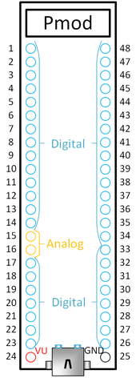

CMOD A7 I/O board pinout assignments proposal
=============================================

Revision 2, 2020-07-03 (SC).

Introduction
------------

For pin numbering of the CMOD-A7 module, see the image in digilent's Reference Guide:

https://reference.digilentinc.com/_media/cmod_a7/cmoda7_b_dip.png

A reduced-size version of this image is shown below:



The DIP module has 48 pins.

Pin 15 and 16 are the analog input channels.

Pin 24 is VU. This can be used as power supply to the CMOD-A7 (in case no USB is connected) or as
power monitor in case USB is connected.

**TODO**: Figure out if/how we can safely use the CMOD module with USB connected or not connected. See [Section 1.1 of the CMOD-A7 reference manual](https://reference.digilentinc.com/reference/programmable-logic/cmod-a7/reference-manual#power_input_options).
A possible solution using a Schottky diode is also mentioned there.

Pin 25 is GND. It is a bit unfortunate that we only have a single ground pin, but it will have to do.

The other 44 pins are PIO (programmable I/O) pins that connect directly to FPGA pins.
All these pins use LVCMOS33 (low voltage CMOS, 3.3V) signal levels.

The 44 PIO pins
---------------

Not all PIO pins are created equal:

* Some FPGA pins are designed for high-performance clock input signals.
* Some FPGA pins can be configured for use as differential pairs.

Below we list all 44 PIO pins, both using their PIO number and their Xilinx I/O pin identifier, for example 'PIO3 (IO_L12P_T1_MRCC_16)'.

We specify whether the pins are 'clock-input-capable or 'regular' (i.e., non clock-input-capable).

Clock-input capable pins are those pins for which the Xilinx I/O pin identifier contains either 'MRCC' or 'SRCC'. These pins can be used to route high-quality clock signals into the FPGA.

* Note 1: Regular pins can also be used to lead clock signals into the FPGA, but this is sub-optimal, discouraged by the Xilinx documentation,
          and requires constraint file overrides to override warnings in Vivado.
* Note 2: Clock signals routed from the inside of the FPGA to the outside can be routed over 'regular' pins without issue.

For pin pairs that can be used as differential pairs, the positive pin is shown first, the negative pin is shown last; and they are separated by a slash.

Note that pair-capable pins don't *have* to be used as pairs, they can also be used as two single-ended pins.
In case of using a clock-input-capable pair as 2 regular pins, the positive pin of the pair can be used as a single-ended clock input.

#### Clock-input-capable differential PIO pairs (6 pairs, 12 pins)

* PIO5       (IO_L11P_T1_SRCC_16)    /  PIO8       (IO_L11N_T1_SRCC_16)
* PIO18      (IO_L12P_T1_MRCC_35)    /  PIO19      (IO_L12N_T1_MRCC_35)
* PIO36      (IO_L12P_T1_MRCC_34)    /  PIO40      (IO_L12N_T1_MRCC_34)
* PIO38      (IO_L11P_T1_SRCC_34)    /  PIO37      (IO_L11N_T1_SRCC_34)
* PIO46      (IO_L13P_T2_MRCC_34)    /  PIO43      (IO_L13N_T2_MRCC_34)
* PIO47      (IO_L14P_T2_SRCC_34)    /  PIO48      (IO_L14N_T2_SRCC_34)

#### Clock-input-capable single-ended PIO pins (1 pin)

* PIO3       (IO_L12P_T1_MRCC_16)

#### Regular (not clock-input-capable) differential PIO pairs (14 pairs, 28 pins)

* PIO2       (IO_L8P_T1_AD14P_35)    /  PIO1       (IO_L8N_T1_AD14N_35)
* PIO6       (IO_L3P_T0_DQS_AD5P_35) /  PIO11      (IO_L3N_T0_DQS_AD5N_35)
* PIO9       (IO_L6P_T0_16)          /  PIO7       (IO_L6N_T0_VREF_16)
* PIO10      (IO_L7P_T1_AD6P_35)     /  PIO4       (IO_L7N_T1_AD6N_35)
* PIO12      (IO_L5P_T0_AD13P_35)    /  PIO14      (IO_L5N_T0_AD13N_35)
* PIO20      (IO_L9P_T1_DQS_AD7P_35) /  PIO17      (IO_L9N_T1_DQS_AD7N_35)
* PIO22      (IO_L10P_T1_AD15P_35)   /  PIO21      (IO_L10N_T1_AD15N_35)
* PIO26      (IO_L2P_T0_34)          /  PIO27      (IO_L2N_T0_34)
* PIO28      (IO_L1P_T0_34)          /  PIO30      (IO_L1N_T0_34)
* PIO29      (IO_L3P_T0_DQS_34)      /  PIO31      (IO_L3N_T0_DQS_34)
* PIO33      (IO_L5P_T0_34)          /  PIO32      (IO_L5N_T0_34)
* PIO35      (IO_L6P_T0_34)          /  PIO34      (IO_L6N_T0_VREF_34)
* PIO41      (IO_L16P_T2_34)         /  PIO39      (IO_L16N_T2_34)
* PIO44      (IO_L9P_T1_DQS_34)      /  PIO42      (IO_L9N_T1_DQS_34)

#### Regular (not clock-input-capable) single-ended PIO pins (3 pins)

* PIO13      (IO_L6N_T0_VREF_35)
* PIO23      (IO_L19N_T3_VREF_35)
* PIO45      (IO_L19P_T3_34)

External interfaces
-------------------

The following interfaces are planned:

* 2x ANALOG-IN (BNC)   — Special pins 15 and 16 of the CMOD module; analog inputs, not PIOs
* 8x DIGITAL-IN (BNC)  — 5 of which will be clock-input-capable pins
* 8x DIGITAL-OUT (BNC)
* 1x REFCLOCK-IN (BNC) — must be a clock-input-capable pin
* 16x Ethernet RGMII   — must have 1 clock-input-capable pin
    - 1x TXC
    - 1x TXCTL
    - 4x TXD
    - 1x RXC           — must be clock-input-capable
    - 1x RXCTL
    - 4x RXD
    - 1x MDC           — pseudo-clock
    - 1x MDIO
    - 1x RESET
    - 1x INTERRUPT
* 8x PMOD              — no special requirements.

The grand total for PIO pins: 41 pins used for the interfaces, 7 of which must be clock-input-capable.

Mapping of available PIOs to interfaces
---------------------------------------

The primary consideration with regard to pin assignment will be the assignment of clock-input-capable pins.
Seven clock-input-capable pins are available on the CMOD A7, and all seven of them will be explicitly used.

Two other considerations are far less important, but can guide the mapping choice in case there are no clear reasons to prefer
one choice over a different choice:

* While our design will not use differential signaling, it is somewhat nice if P/N pairs are used for ports that have similar
  functions and sit next to each other. For example, for our 8 BNC outputs, it is nice if we use 4 differential pin pairs.
* Inside the FPGA, the signals are organized in I/O banks. It is nice to aim to assign similar functions to the same I/O bank,
  e.g. to have all digital I/O inputs connected to FPGA pins belonging to bank 34.

However, other considerations such as PCB layout may lead to deviations from these 'nice-to-have' guidelines!

Pin mapping proposal
--------------------

The following proposed mapping is not set in stone.
It can be revised if considerations such as PCB layout require it.

#### Analog input (2 pins)

The analog input pins are fixed by the CMOD A7 design to pins 15 and 16 of the DIP module.

function         | remarks                                              | pin
---------------- | ---------------------------------------------------- | ---
BNC Analog-In #1 | via filter, buffer; range mapped from 0…5V to 0…3.3V | 15
BNC Analog-In #2 | via filter, buffer; range mapped from 0…5V to 0…3.3V | 16

#### Digital output pins via BNC (8 pins)

We want 8 digital outputs; they don't need to be clock-input-capable.

We select these from bank 34.

Consecutive odd/even numbered digital outputs are chosen to be positive/negative FPGA pins of a
differential I/O pair of the FPGA.

function           | remarks       | proposed pin
------------------ | ------------- | -----------------------------
BNC Digital-Out #0 |               | PIO26      (IO_L2P_T0_34)
BNC Digital-Out #1 |               | PIO27      (IO_L2N_T0_34)
BNC Digital-Out #2 |               | PIO28      (IO_L1P_T0_34)
BNC Digital-Out #3 |               | PIO30      (IO_L1N_T0_34)
BNC Digital-Out #4 |               | PIO29      (IO_L3P_T0_DQS_34)
BNC Digital-Out #5 |               | PIO31      (IO_L3N_T0_DQS_34)
BNC Digital-Out #6 |               | PIO33      (IO_L5P_T0_34)
BNC Digital-Out #7 |               | PIO32      (IO_L5N_T0_34)

#### Digital input pins via BNC (8 pins, 5 of which are clock-input-capable)

We want 8 digital inputs, with 5 of them clock-input-capable.

We get 4 clock-capable inputs from bank 34, and 1 from bank 16.

Consecutive odd/even numbered digital outputs are chosen to be positive/negative FPGA pins of a
differential I/O pair of the FPGA, except for channel #7. Making the clock-input-capable PIO5
pin available is more important.

function          | remarks             | proposed pin
----------------- | ------------------- | -------------------------------
BNC Digital-In #0 | clock-input-capable | PIO47      (IO_L14P_T2_SRCC_34)
BNC Digital-In #1 |                     | PIO48      (IO_L14N_T2_SRCC_34)
BNC Digital-In #2 | clock-input-capable | PIO46      (IO_L13P_T2_MRCC_34)
BNC Digital-In #3 |                     | PIO43      (IO_L13N_T2_MRCC_34)
BNC Digital-In #4 | clock-input-capable | PIO38      (IO_L11P_T1_SRCC_34)
BNC Digital-In #5 |                     | PIO37      (IO_L11N_T1_SRCC_34)
BNC Digital-In #6 | clock-input-capable | PIO36      (IO_L12P_T1_MRCC_34)
BNC Digital-In #7 | clock-input-capable | PIO5       (IO_L11P_T1_SRCC_16)

#### External clock reference (1 pin, clock-input-capable)

The reference clock input will connect to PIO3, the one purely single-ended clock pin available
on the CMOD-A7 DIP pinout.

function          | remarks                                       | proposed pin
----------------- | --------------------------------------------- | -------------------------
BNC RefClock-In   | clock-capable; via AC coupling and comparator | PIO3 (IO_L12P_T1_MRCC_16)

#### Ethernet PHY, RGMII (16 pins, one of which must be clock-capable)

We need 16 I/Os, with one of them clock-capable (RXC).

The pin mapping was chosen mostly to give a natural pin order with respect to the pinout of the RTL8211F PHY,
which should aid routing.


function          | remarks             | proposed pin
----------------- | ------------------- | ----------------------------------
Ethernet TXC      |                     | PIO6       (IO_L3P_T0_DQS_AD5P_35)
Ethernet TXCTL    |                     | PIO7       (IO_L6N_T0_VREF_16)
Ethernet TXD0     |                     | PIO8       (IO_L11N_T1_SRCC_16)
Ethernet TXD1     |                     | PIO9       (IO_L6P_T0_16)
Ethernet TXD2     |                     | PIO10      (IO_L7P_T1_AD6P_35)
Ethernet TXD3     |                     | PIO11      (IO_L3N_T0_DQS_AD5N_35)
Ethernet MDIO     |                     | PIO12      (IO_L5P_T0_AD13P_35)
Ethernet MDC      |                     | PIO13      (IO_L6N_T0_VREF_35)
Ethernet PHYSRSTB |                     | PIO14      (IO_L5N_T0_AD13N_35)
Ethernet RXC      | clock-input-capable | PIO17      (IO_L9N_T1_DQS_AD7N_35)
Ethernet RXCTL    |                     | PIO18      (IO_L12P_T1_MRCC_35)
Ethernet RXD0     |                     | PIO19      (IO_L12N_T1_MRCC_35)
Ethernet RXD1     |                     | PIO20      (IO_L9P_T1_DQS_AD7P_35)
Ethernet RXD2     |                     | PIO21      (IO_L10N_T1_AD15N_35)
Ethernet RXD3     |                     | PIO22      (IO_L10P_T1_AD15P_35)
Ethernet INTB     |                     | PIO23      (IO_L19N_T3_VREF_35)
 
#### Digilent PMOD connector (8 pins, no special requirements)

We need 8 I/Os, with no requirements on clock capability.


These are the leftover differential pair pins, coming from banks 34 and 35.

Consecutive IOs are chosen to be positive/negative FPGA pins of a differential I/O pair of the FPGA.

**TO BE DECIDED: will we give the PMOD connectors a standard 200 Ohm series resistor? This is safer, and we already have BNCs for high-quality signals. So probably yes.**

function          | remarks | proposed pin
----------------- | ------- | ------------------------------
PMOD_p1           |         | PIO2       (IO_L8P_T1_AD14P_35)
PMOD_p2           |         | PIO1       (IO_L8N_T1_AD14N_35)
PMOD_p3           |         | PIO44      (IO_L9P_T1_DQS_34)
PMOD_p4           |         | PIO42      (IO_L9N_T1_DQS_34)
PMOD_p7           |         | PIO41      (IO_L16P_T2_34)
PMOD_p8           |         | PIO39      (IO_L16N_T2_34)
PMOD_p9           |         | PIO35      (IO_L6P_T0_34)
PMOD_p10          |         | PIO34      (IO_L6N_T0_VREF_34)

#### Unused (spare) pins

function          | remarks | unused pin
----------------- | ------- | -------------------------------
(unused)          |         | PIO4       (IO_L7N_T1_AD6N_35)
(unused)          |         | PIO40      (IO_L12N_T1_MRCC_34)
(unused)          |         | PIO45      (IO_L19P_T3_34)

Mapping proposal — physical layout
----------------------------------

```
                                              +------------------------+
                      PMOD:pin2      rp1n -<>-|  1 (35)        (34) 48 |-<-- cp6n   BNC:DIGIN-Ch1
                      PMOD:pin1      rp1p -<>-|  2 (35)        (34) 47 |-<-- cp6p   BNC:DIGIN-Ch0 (clock-input-capable)
(clock-input-capable) BNC:REFLCK-IN   c7p -->-|  3 (16)        (34) 46 |-<-- cp5p   BNC:DIGIN-Ch2 (clock-input-capable)
                      (unused)       rp4n x---|  4 (35)        (34) 45 |---x (s)    (unused)
(clock-input-capable) BNC:DIGIN-Ch7  cp1p -->-|  5 (16)        (34) 44 |-<>- rp14p  PMOD:pin3
                      PHY:TXC        rp2p -<--|  6 (35)        (34) 43 |-<-- cp5n   BNC:DIGIN-Ch3
                      PHY:TXCTL      rp3n -<--|  7 (16)        (34) 42 |-<>- rp14n  PMOD:pin4
                      PHY:TXD0       cp1n -<--|  8 (16)        (34) 41 |-<>- rp13p  PMOD:pin7
                      PHY:TXD1       rp3p -<--|  9 (16)        (34) 40 |---x cp3n   (unused)
                      PHY:TXD2       rp4p -<--| 10 (35)        (34) 39 |-<>- rp13n  PMOD:pin8
                      PHY:TXD3       rp2n -<--| 11 (35)        (34) 38 |-<-- cp4p   BNC:DIGIN-Ch4 (clock-input-capable)
                      PHY:MDIO       rp5p -<>-| 12 (35)        (34) 37 |-<-- cp4n   BNC:DIGIN Ch5
                      PHY:MDC         (s) -<--| 13 (35)        (34) 36 |-<-- cp3p   BNC:DIGIN-Ch6 (clock-input-capable)
                      PHY:PHYRSTB    rp5n -<--| 14 (35)        (34) 35 |-<>- rp12p  PMOD:pin9
                      BNC:ADC-Ch0   (adc) ->--| 15 analog-in   (34) 34 |-<>- rp12n  PMOD:pin10
                      BNC:ADC-Ch1   (adc) ->--| 16 analog-in   (34) 33 |-->- rp11p  BNC:DIGOUT-Ch6
                      PHY:INTB       rp6n ->--| 17 (35)        (34) 32 |-->- rp11n  BNC:DIGOUT-Ch7
(clock-input-capable) PHY:RXC        cp2p ->--| 18 (35)        (34) 31 |-->- rp10n  BNC:DIGOUT-Ch5
                      PHY:RXCTL      cp2n ->--| 19 (35)        (34) 30 |-->- rp9n   BNC:DIGOUT-Ch3
                      PHY:RXD0       rp6p ->--| 20 (35)        (34) 29 |-->- rp10p  BNC:DIGOUT-Ch4
                      PHY:RXD1       rp7n ->--| 21 (35)        (34) 28 |-->- rp9p   BNC:DIGOUT-Ch2
                      PHY:RXD2       rp7p ->--| 22 (35)        (34) 27 |-->- rp8n   BNC:DIGOUT-Ch1
                      PHY:RXD3        (s) ->--| 23 (35)        (34) 26 |-->- rp8p   BNC:DIGOUT-Ch0
                      VU                  ----| 24 power     ground 25 |---         GND
                                              +------------------------+
```
