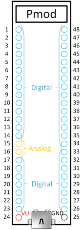

CMOD A7 I/O board pinout assignments proposal
=============================================

Introduction
------------

For pin numbering of the CMOD-A7 module, see the image in digilent's Reference Guide:

https://reference.digilentinc.com/_media/cmod_a7/cmoda7_b_dip.png

A reduced-size version of this image is shown below:

The DIP module has 48 pins.

Pin 15 and 16 are the analog input channels.

Pin 24 is VU. This can be used as power supply to the CMOD-A7 (in case no USB is connected) or as
power monitor in case USB is connected.

**TODO**: Figure out if/how we can safely use the CMOD module with USB connected or not connected. See [Section 1.1 of the CMOD-A7 reference manual](https://reference.digilentinc.com/reference/programmable-logic/cmod-a7/reference-manual#power_input_options). A possible solution using a Schottky diode is also mentioned there.

Pin 25 is GND. It is a bit unfortunate that we only have a single ground pin, but it will have to do.

The other 44 pins are PIO (programmable I/O) pins that connect directly to FPGA pins.
All these pins use LVCMOS33 (low voltage CMOS, 3.3V) signal levels.

The 44 PIO pins
---------------

Not all PIO pins are created equal:

* Some FPGA pins are designed for use as high-performance clock signals.
* Some FPGA pins can be configured for use as differential pairs.

Below we list all 44 PIO pins, both using their PIO number and their Xilinx I/O pin identifier, for example 'PIO3 (IO_L12P_T1_MRCC_16)'.

We specify whether the pins are 'clock-capable or 'regular' (i.e., non clock-capable). Clock capable pins are those pins for which the Xilinx I/O pin identifier contains either 'MRCC' or 'SRCC'.

For pin pairs that can be used as differential pairs, the positive pin is shown first, the negative pin is shown last; and they
are separated by a slash.

Note that pair-capable pins don't *have* to be used as pairs, they can also be used as two single-ended pins.
In case of using a clock-capable pair as 2 regular pins, the positive pin of the pair can be used as a single-ended clock input.

#### Clock-capable differential PIO pairs (6 pairs, 12 pins)

* PIO5       (IO_L11P_T1_SRCC_16)    /  PIO8       (IO_L11N_T1_SRCC_16)
* PIO18      (IO_L12P_T1_MRCC_35)    /  PIO19      (IO_L12N_T1_MRCC_35)
* PIO36      (IO_L12P_T1_MRCC_34)    /  PIO40      (IO_L12N_T1_MRCC_34)
* PIO38      (IO_L11P_T1_SRCC_34)    /  PIO37      (IO_L11N_T1_SRCC_34)
* PIO46      (IO_L13P_T2_MRCC_34)    /  PIO43      (IO_L13N_T2_MRCC_34)
* PIO47      (IO_L14P_T2_SRCC_34)    /  PIO48      (IO_L14N_T2_SRCC_34)

#### Clock-capable single-ended PIO pins (1 pin)

* PIO3       (IO_L12P_T1_MRCC_16)

#### Regular (not clock-capable) differential PIO pairs (14 pairs, 28 pins)

* PIO2       (IO_L8P_T1_AD14P_35)    /  PIO1       (IO_L8N_T1_AD14N_35)
* PIO6       (IO_L3P_T0_DQS_AD5P_35) /  PIO11      (IO_L3N_T0_DQS_AD5N_35)
* PIO9       (IO_L6P_T0_16)          /  PIO7       (IO_L6N_T0_VREF_16)
* PIO10      (IO_L7P_T1_AD6P_35)     /  PIO4       (IO_L7N_T1_AD6N_35)
* PIO12      (IO_L5P_T0_AD13P_35)    /  PIO14      (IO_L5N_T0_AD13N_35)
* PIO20      (IO_L9P_T1_DQS_AD7P_35) /  PIO17      (IO_L9N_T1_DQS_AD7N_35)
* PIO22      (IO_L10P_T1_AD15P_35)   /  PIO21      (IO_L10N_T1_AD15N_35)
* PIO26      (IO_L2P_T0_34)          /  PIO27      (IO_L2N_T0_34)
* PIO28      (IO_L1P_T0_34)          /  PIO30      (IO_L1N_T0_34)
* PIO29      (IO_L3P_T0_DQS_34)      /  PIO31      (IO_L3N_T0_DQS_34)
* PIO33      (IO_L5P_T0_34)          /  PIO32      (IO_L5N_T0_34)
* PIO35      (IO_L6P_T0_34)          /  PIO34      (IO_L6N_T0_VREF_34)
* PIO41      (IO_L16P_T2_34)         /  PIO39      (IO_L16N_T2_34)
* PIO44      (IO_L9P_T1_DQS_34)      /  PIO42      (IO_L9N_T1_DQS_34)

#### Regular (not clock-capable) single-ended PIO pins (3 pins)

* PIO13      (IO_L6N_T0_VREF_35)
* PIO23      (IO_L19N_T3_VREF_35)
* PIO45      (IO_L19P_T3_34)

External interfaces
-------------------

The following interfaces are planned:

* 2x ANALOG-IN (BNC)   — Special pins 15 and 16 of the CMOD module; analog inputs, not PIOs
* 8x DIGITAL-IN (BNC)  — 2 of which are clock-capable
* 8x DIGITAL-OUT (BNC) — 2 of which are clock-capable
* 1x REFCLOCK-IN (BNC) — must be clock-capable
* 16x Ethernet RGMII   — 2 of which must be clock-capable, as listed below:
    - 1x TXC           — must be clock-capable
    - 1x TXCTL
    - 4x TXD
    - 1x RXC           — 1 must be clock-capable
    - 1x RXCTL
    - 4x RXD
    - 1x MDC           — pseudo-clock, no need to make it clock-capable.
    - 1x MDIO
    - 1x RESET
    - 1x INTERRUPT
* 8x PMOD              — no special requirements.

The grand total for PIO pins: 41 pins used for the interfaces, 7 of which must be clock-capable.

Mapping of available PIOs to interfaces
---------------------------------------

The primary consideration wth regard to pin assignment will be the assignment of clock-capable pins. 7 are required, and 7 are available.

Two other considerations are far less important, but can guide the mapping choice in case there are no clear reasons to prefer
one choice to a different choice:

* While our design will not use differential signaling, it is somewhat nice if P/N pairs are used for ports that have similar
  functions and sit next to each other. For example, for our 8 BNC inputs, it is nice if we use 4 differential pin pairs.
* Inside the FPGA, the signals are organized in I/O banks. It is nice to aim to assign similar functions to the same I/O bank,
  e.g. to have all digital I/O inputs connected to FPGA pins belonging to bank 34.

However, PCB layout considerations may lead to deviations from these 'nice-to-have' guidelines!

A first pin mapping proposal
----------------------------

The following proposed mapping is a starting point for the discussion based on the guidelines given above.
These can certainly be revised if considerations such as PCB layout require it.

#### Analog input (2 pins)

The analog input pins are fixed by the CMOD A7 design to pins 15 and 16 of the DIP module.

function         | remarks                                              | pin
---------------- | ---------------------------------------------------- | -----
BNC Analog-In #1 | via filter, buffer; range mapped from 0-5V to 0-3.3V | 15
BNC Analog-In #2 | via filter, buffer; range mapped from 0-5V to 0-3.3V | 16

#### Digital output pins via BNC (8 pins, 2 of which are clock-capable)

We want 8 digital outputs, with 2 of them clock-capable.

We get the clock-capable outputs from bank 34, and select the other pins from bank 34 as well.

Consecutive odd/even numbered digital outputs are chosen to be positive/negative FPGA pins of a
differential I/O pair of the FPGA.

function           | remarks       | proposed pin
------------------ | ------------- | -------------------------------
BNC Digital-Out #1 | clock-capable | PIO36      (IO_L12P_T1_MRCC_34)
BNC Digital-Out #2 |               | PIO40      (IO_L12N_T1_MRCC_34)
BNC Digital-Out #3 | clock-capable | PIO38      (IO_L11P_T1_SRCC_34)
BNC Digital-Out #4 |               | PIO37      (IO_L11N_T1_SRCC_34)
BNC Digital-Out #5 |               | PIO26      (IO_L2P_T0_34)
BNC Digital-Out #6 |               | PIO27      (IO_L2N_T0_34)
BNC Digital-Out #7 |               | PIO28      (IO_L1P_T0_34)
BNC Digital-Out #8 |               | PIO30      (IO_L1N_T0_34)

#### Digital input pins via BNC (8 pins, 2 of which are clock-capable)

We want 8 digital inputs, with 2 of them clock-capable.

We get the clock-capable inputs from bank 34, and select the other pins from bank 34 as well.

Consecutive odd/even numbered digital outputs are chosen to be positive/negative FPGA pins of a
differential I/O pair of the FPGA.

function          | remarks       | proposed pin
----------------- | ------------- | -------------------------------
BNC Digital-In #1 | clock-capable | PIO46      (IO_L13P_T2_MRCC_34)
BNC Digital-In #2 |               | PIO43      (IO_L13N_T2_MRCC_34)
BNC Digital-In #3 | clock-capable | PIO47      (IO_L14P_T2_SRCC_34)
BNC Digital-In #4 |               | PIO48      (IO_L14N_T2_SRCC_34)
BNC Digital-In #5 |               | PIO29      (IO_L3P_T0_DQS_34)
BNC Digital-In #6 |               | PIO31      (IO_L3N_T0_DQS_34)
BNC Digital-In #7 |               | PIO33      (IO_L5P_T0_34)
BNC Digital-In #8 |               | PIO32      (IO_L5N_T0_34)

#### External clock reference (1 pin, clock capable)

The reference clock input will connect to PIO3, the one purely single-ended clock pin available
on the CMOD-A7 DIP pinout.

function          | remarks                                       | proposed pin
----------------- | --------------------------------------------- | -------------------------
BNC RefClock-In   | clock-capable; via AC coupling and comparator | PIO3 (IO_L12P_T1_MRCC_16)

#### Ethernet RGMII (16 pins, 2 of which are clock-capable)

We need 16 I/Os, with 2 of them clock-capable.

We get one of the clocks from bank 16, and the other one from bank 35. All other pins are
taken from bank 35 as well.

Consecutive IOs are chosen to be positive/negative FPGA pins of a differential I/O pair of the FPGA.

function           | remarks                            | proposed pin
------------------ | ---------------------------------- | ----------------------------------
Ethernet TXC       | clock-capable                      | PIO5       (IO_L11P_T1_SRCC_16)
Ethernet TXCTL     |                                    | PIO8       (IO_L11N_T1_SRCC_16)
Ethernet TXD0      |                                    | PIO2       (IO_L8P_T1_AD14P_35)
Ethernet TXD1      |                                    | PIO1       (IO_L8N_T1_AD14N_35)
Ethernet TXD2      |                                    | PIO6       (IO_L3P_T0_DQS_AD5P_35)
Ethernet TXD3      |                                    | PIO11      (IO_L3N_T0_DQS_AD5N_35)
Ethernet RXC       | clock-capable                      | PIO18      (IO_L12P_T1_MRCC_35)
Ethernet RXCTL     |                                    | PIO19      (IO_L12N_T1_MRCC_35)
Ethernet RXD0      |                                    | PIO10      (IO_L7P_T1_AD6P_35)
Ethernet RXD1      |                                    | PIO4       (IO_L7N_T1_AD6N_35)
Ethernet RXD2      |                                    | PIO12      (IO_L5P_T0_AD13P_35)
Ethernet RXD3      |                                    | PIO14      (IO_L5N_T0_AD13N_35)
Ethernet MDC       | no need to make this clock-capable | PIO20      (IO_L9P_T1_DQS_AD7P_35)
Ethernet MDIO      |                                    | PIO17      (IO_L9N_T1_DQS_AD7N_35)
Ethernet RESET     |                                    | PIO22      (IO_L10P_T1_AD15P_35)
Ethernet INTERRUPT |                                    | PIO21      (IO_L10N_T1_AD15N_35)

#### Digilent PMOD connector (8 pins, no special requirements)

We need 8 I/Os, with no requirements on clock capability.

These are the leftover differential pair pins, coming from banks 34 and 16.

Consecutive IOs are chosen to be positive/negative FPGA pins of a differential I/O pair of the FPGA.

function           | remarks                            | proposed pin
------------------ | ---------------------------------- | ------------------------------
PMOD_p1            |                                    | PIO35      (IO_L6P_T0_34)
PMOD_p2            |                                    | PIO34      (IO_L6N_T0_VREF_34)
PMOD_p3            |                                    | PIO41      (IO_L16P_T2_34)
PMOD_p4            |                                    | PIO39      (IO_L16N_T2_34)
PMOD_p7            |                                    | PIO44      (IO_L9P_T1_DQS_34)
PMOD_p8            |                                    | PIO42      (IO_L9N_T1_DQS_34)
PMOD_p9            |                                    | PIO9       (IO_L6P_T0_16)
PMOD_p10           |                                    | PIO7       (IO_L6N_T0_VREF_16)

#### Unused (spare) pins

function           | remarks | unused pin
------------------ | ------- | -------------------------------
(unused)           |         | PIO13      (IO_L6N_T0_VREF_35)
(unused)           |         | PIO23      (IO_L19N_T3_VREF_35)
(unused)           |         | PIO45      (IO_L19P_T3_34)
